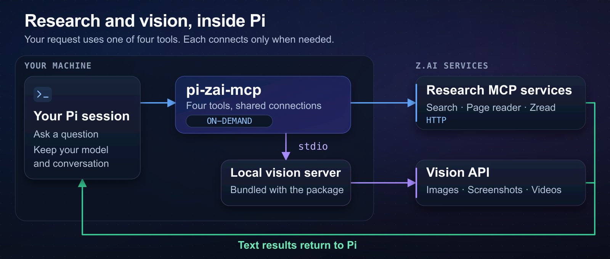

# pi-zai-mcp

pi-zai-mcp gives Pi four Z.AI tools: web search, page reader, public repository reader, and image/video analysis. Mitch Fultz maintains this unofficial Z.AI integration.



_Pi keeps your chosen coding model and conversation._

## Install and start

You need [Pi](https://pi.dev), Node.js 22.19 or newer, and a Z.AI API key with a compatible GLM Coding Plan. Pi 1.0.0 is the suggested support floor.

```bash
pi install npm:pi-zai-mcp
export Z_AI_API_KEY="your_z_ai_api_key"
pi
```

You can also use a key stored through Pi's `/login` command. The extension accepts `ZAI_API_KEY` and `ZAI_CODING_CN_API_KEY`. Environment variables take precedence over stored keys.

In Pi, enter:

> Use z_ai_search to find the latest Node.js release notes.

Run `/zai-mcp-status` to check each service. The status shows `lazy_not_connected_until_first_use` until a service connects. Each service connects on its first tool call. Pi startup makes no paid tool calls.

See [other install options](docs/reference.md#other-install-options) for a temporary session or a GitHub install.

## Tools

| Tool          | Use                                                                             |
| ------------- | ------------------------------------------------------------------------------- |
| `z_ai_search` | Search the web with domain and recency filters.                                 |
| `z_ai_reader` | Read a URL as Markdown or text.                                                 |
| `z_ai_zread`  | Search public GitHub repositories, read files, or list directories.             |
| `z_ai_vision` | Analyze screenshots, text, diagrams, charts, UI comparisons, images, or videos. |

See [GLM model setup](docs/glm-setup.md) to configure the coding model.

Run `pi config` to enable or disable each tool. Keep `extensions/zai-mcp-status.ts` enabled for `/zai-mcp-status`.

Pi shows progress and compact results. Press **Ctrl+O** to expand a result. Large results stop at 50 KB or 2,000 lines. The result includes a path to the full text in a private temporary file. Remove saved files when you no longer need them.

## Limits and cost

Vision needs a local file path or remote URL. UI comparisons need both reference and actual screenshots. Videos must use MP4, MOV, or M4V format and must not exceed 8 MB.

Zread can reject repositories that Z.AI has not indexed. Real tool calls require network access and consume your plan allowance. Check [Z.AI's usage policy](https://docs.z.ai/devpack/usage-policy) for current pricing.

Vision defaults to `glm-5.3-flash` with a 131,072-token output ceiling. Large outputs can increase cost. Set `Z_AI_VISION_MODEL_MAX_TOKENS` to reduce this ceiling.

If a call fails, run `/zai-mcp-status`. Check `lastError`, your API key, plan entitlement, and network connection. See the [configuration reference](docs/reference.md#configure) for timeouts and vision settings.

## Privacy

Pi extensions run with your user permissions. Review the code before installation. These tools send requests and visual input to Z.AI.

The extension stores no credentials. It passes only the selected Z.AI key, safe platform variables, and allowed settings to the vision server.

The vision server logs prompts and image paths under `~/.zai` by default. Set `ZAI_MCP_LOG_PATH` to a private or non-persisting destination when needed. Treat retrieved pages and repository text as untrusted content.

## Reference

- [Tool and configuration reference](docs/reference.md): arguments, settings, data flow, and service limits.
- [Development and maintenance](docs/development.md): local setup, tests, code-quality policy, and releases.
- [Changelog](CHANGELOG.md) and [dated Pi qualification results](PI_1_0_QUALIFICATION.md).
- [Report a problem](https://github.com/fitchmultz/pi-zai-mcp/issues).

## License

[MIT](LICENSE) — Mitch Fultz.
